```mermaid
graph TD
    A[🎯 Current Focus] --> B[Advanced TypeScript]
    A --> C[GraphQL APIs]
    A --> D[Docker & CI/CD]
    A --> E[Microservices]
    
    B --> F[🚀 Next Goals]
    C --> F
    D --> F
    E --> F
    
    F --> G[React Native Mobile]
    F --> H[AI/ML Integration]
    F --> I[Web3 & Blockchain]
    F --> J[AWS Certification]
    
    style A fill:#00D9FF,stroke:#fff,stroke-width:2px,color:#000
    style F fill:#FF6B6B,stroke:#fff,stroke-width:2px,color:#000
```

# <div align="center"> Hi 👋, I'm Mohammad Razak A</div>

<div align="center">
  
  
  
  <br/>
  
  [](https://mohammadrazak.xyz)
  [](https://www.linkedin.com/in/mohammadrazak-abdulrasheeth/)
  [](mailto:mrazak338@gmail.com)

</div>

<br/>

<div align="center">
  
</div>

##  **About Me**


```typescript
const developer = {
  name: "Mohammad Razak A",
  role: "Full-Stack Developer",
  company: "ValueMomentum",
  location: "Coimbatore, India 🇮🇳",
  
  skills: {
    frontend: ["React", "Next.js", "TypeScript", "Tailwind", "Redux"],
    backend: ["Node.js", "Express", "Socket.IO", "Prisma"],
    database: ["MongoDB", "PostgreSQL", "MySQL"],
    cloud: ["Firebase", "Vercel", "Netlify"],
    mobile: ["PWA", "React Native (learning)"]
  },
  
  passion: "Building real-time, scalable applications ⚡",
  experience: "3+ years crafting digital solutions 🚀",
  currentFocus: "Advanced TypeScript & Microservices 🎯"
};
```

<br clear="right"/>

---

##  **Tech Arsenal**

<div align="center">

### **Frontend Mastery**


### **Backend Power**


### **Database & Cloud**


</div>

---

##  **Featured Projects**

<div align="center">
  
### 🌟 **[RazChatz - Real-Time Chat Platform](https://razchatz.netlify.app/)**


**Modern messaging platform with real-time capabilities**

<details>
<summary><b>🔥 Key Features & Tech Stack</b></summary>

- ⚡ **Real-time messaging** with Socket.IO WebSockets
- 👁️ **Message status tracking** (delivered/seen indicators)  
- 📅 **Smart date grouping** with Day.js integration
- 😊 **Emoji picker** for enhanced user expression
- 🔔 **Push notifications** via service workers
- 🔐 **JWT authentication** with protected routes
- 📱 **Responsive design** across all devices

**Tech:** React • Socket.IO • Node.js • MongoDB • Material UI • Redux

</details>

---

### 🎯 **[Placement Training System](https://pts-by-razak.netlify.app)**


**Complete MERN platform for campus recruitment workflows**

<details>
<summary><b>🔥 Advanced Features & Integration</b></summary>

- 👥 **Multi-role authentication** (Students/TPOs/Admins)
- 📚 **Interactive learning hub** with quizzes & videos
- 💻 **Live code compiler** with third-party API
- 📊 **Google Sheets sync** for real-time data
- 🔔 **Smart notifications** with email automation
- 📱 **PWA enabled** - offline-ready experience
- 🖼️ **Firebase storage** for secure media handling

**Tech:** React • Node.js • MongoDB • Google APIs • Firebase • Tailwind

</details>

---

### 🛡️ **[Raz Insurance Platform](https://razinsurance.netlify.app)**


**Modern insurance management with admin dashboard**

<details>
<summary><b>🔥 Enterprise Features</b></summary>

- 🔐 **Role-based authentication** for customers & admins
- 📋 **Dynamic policy management** with status tracking
- 🛡️ **Comprehensive coverage** with smart conditions
- ⚙️ **Admin dashboard** for instant verification
- 📱 **PWA + SEO optimized** with meta tags
- 💡 **Modern UI/UX** with Tailwind & Material UI

**Tech:** React • Node.js • PostgreSQL • Prisma ORM • Tailwind

</details>

</div>

---

##  **GitHub Analytics**

<div align="center">
  
  
  
  
  

</div>

---

##  **Current Learning Journey**

<div align="center">



</div>

---

##  **Professional Journey**

<div align="center">
  
| Role | Company | Duration | Focus |
|------|---------|----------|-------|
| 💼 **Software Developer** | ValueMomentum | Feb 2025 - Present | MERN Stack, Real-time Systems |
| 🎓 **Full-Stack Developer** | KG College of Arts & Science | Jan 2024 - Sep 2024 | Campus Management, API Integration |

</div>

---

##  **Let's Build Together!**

<div align="center">

**Passionate about collaborating on:**

🌐 **Real-time applications** • 📱 **Progressive Web Apps** • 🔄 **API integrations** • 🎨 **Modern UI/UX** • 📊 **Data visualization**

<br/>


<br/>

### **Ready to innovate? Let's connect! 🚀**

[](https://mohammadrazak.xyz)
[](https://www.linkedin.com/in/mohammadrazak-abdulrasheeth/)
[](mailto:mrazak338@gmail.com)

<br/>

**⚡ Fun Fact:** I transform complex business logic into elegant, user-friendly web experiences—and yes, I'm slightly obsessed with emojis! 🌐💬✨

<br/>


</div>

<div align="center">
  
</div>
